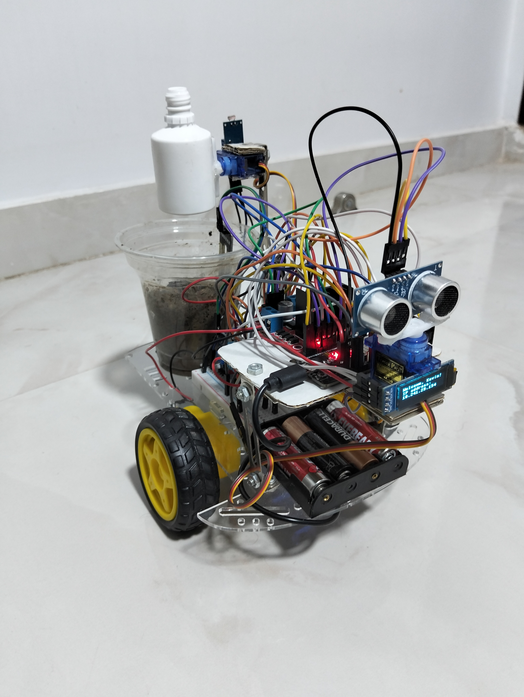

# 🌱 Smart Plant Care & Rover with ESP32

This project is a **Wi-Fi controlled rover + smart plant monitoring system** powered by an ESP32.  
It combines environmental sensing, automatic watering, OLED animations, and a web-based control station.

  

---

## ✨ Features

- 🚗 **Rover Control**
  - Move forward, backward, left, right, or stop directly from a web interface
  - Obstacle avoidance using an **ultrasonic sensor**
  - Automatic turning logic when blocked
  - Automatic light searching and moving for proper plant growth

- 🌿 **Plant Monitoring**
  - **Soil moisture sensor** with automatic watering via servo
  - **DHT11 sensor** for temperature 🌡 and humidity 💦
  - **LDR light sensor** for sunlight detection ☀️
  - **OLED screen** for IP display and animations of a growing plant 🌱

- 💧 **Automatic Watering**
  - Waters the plant if soil moisture drops below 30%
  - Can be toggled on/off from the web interface

- ☀️ **Searching for places with sunlight**
  - Moves in random places while also avoiding obstacles untill it finds sunlight for healthy plant growth 🌱

- 📱 **Web Dashboard**
  - Live plant information (soil moisture, temperature, humidity, light level)
  - Control buttons for movement, watering, and refreshing data
  - Responsive design for desktop and mobile

- 🖥 **OLED Display**
  - Shows welcome message with ESP32’s IP
  - Displays an animated growing plant after refreshing plant data
    
- 👩‍💻 **Programming Language**
  - It was programmed in Micro-Python
  - 
    
---

## 🛠 Hardware Used

- ESP32 WROOM Devkit V1
- Soil Moisture Sensor
- DHT11 Temperature & Humidity Sensor
- LDR Light Sensor with 4.7kΩ resistor
- Ultrasonic Distance Sensor (HC-SR04)
- 0.96" OLED Display (I²C, SSD1306 driver)
- 2 Servos (watering arm + ultrasonic scanning)
- L298N Motor Driver
- 2 DC Motors (left + right drive)
- 6V battery pack for motors/servos
- 5V power bank for ESP32
- Breadboard (Optional)

---

## 🔌 Circuit Diagram

---

## 🌱 Web Interface Preview

- Control rover movement (forward, back, left, right, stop)
- Monitor plant health
- Trigger watering and toggle auto-watering
- Get live distance readings

  

---

## 🧠 How It Works

- Sensors gather plant/environment data.

- ESP32 serves a webpage over Wi-Fi.

- User controls rover & watering system from any browser.

- OLED animates plant growth as feedback.

---
## ⚙ Maker:
This project was made by **Kevin Ehab**💖
